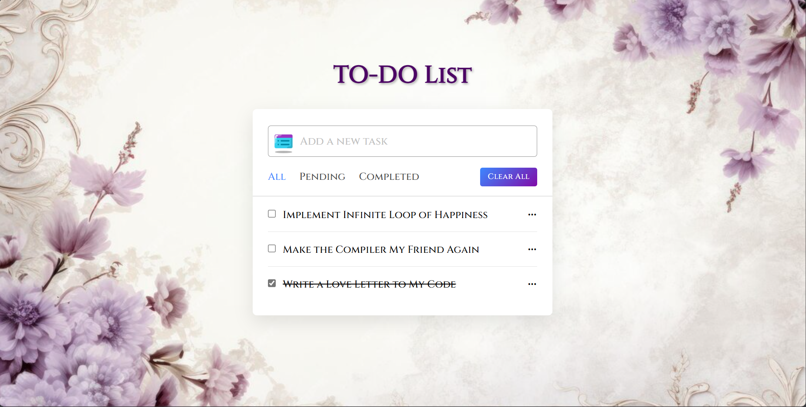

# To-Do List Project

**To-Do List** is a simple web application for managing your daily tasks. It allows you to add, edit, delete, and filter tasks easily.

## Features

- **Add Tasks**: Add new tasks to your to-do list.
- **Edit Tasks**: Edit existing tasks.
- **Delete Tasks**: Delete tasks that are no longer needed.
- **Filter Tasks**: Filter tasks by all, completed, or pending status.

## Output

